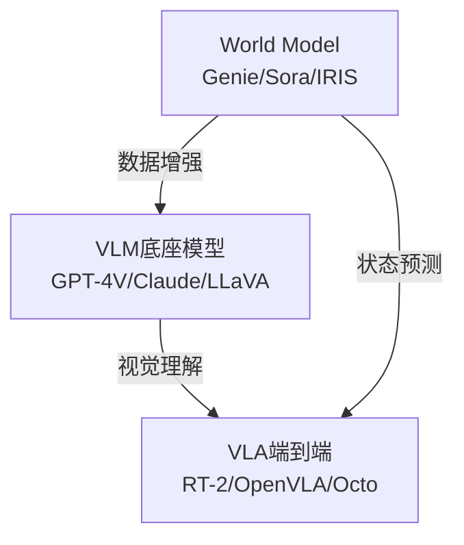

# 01-Foundation: 模型层

## §0 — One-liner

VLM底座、World Model、VLA端到端模型的选型地图——理解不同模型家族的定位、能力与数据需求。

## §1 — Concept Map

## §2 — Layer Responsibilities

本层回答：**用什么模型？需要什么样的数据？**

| 能力维度 | VLM | World Model | VLA |
|----------|-----|-------------|-----|
| 视觉理解 | ✅✅✅ | ✅✅ | ✅✅ |
| 语言理解 | ✅✅✅ | ✅ | ✅✅ |
| 动作生成 | ❌ | ⚠️ 预测 | ✅✅✅ |
| 物理推理 | ⚠️ | ✅✅✅ | ⚠️ |
| 数据需求 | 图文对 | 视频序列 | 动作轨迹 |

## §3 — Topics

| Topic | Status | Description |
|-------|--------|-------------|
| [01-vlm](01-vlm.md) | draft | VLM底座模型：GPT-4V, Claude, 开源方案 |
| [02-world-model](02-world-model.md) | draft | World Model：状态预测与物理建模 |
| [03-vla](03-vla.md) | draft | VLA端到端：RT-1/2, OpenVLA, Octo |
| [04-architecture-patterns](04-architecture-patterns.md) | not-started | 架构模式对比 |

## §4 — Downstream Connections

- **To 02-annotation**: 模型能力决定标注策略
  - VLM → 场景理解标注
  - VLA → 动作轨迹标注
  - World Model → 因果/物理标注

- **To 05-integration**: 模型选型影响系统架构
  - 云端API vs 本地部署
  - 实时性要求
  - 推理成本

## §5 — Quick Decision Guide

| 场景 | 推荐起点 |
|------|----------|
| 已有感知模块，需高层规划 | VLM + 规则引擎 |
| 端到端操作学习 | VLA (RT-2/OpenVLA) |
| 需要反事实推理/模拟 | World Model |
| 数据稀缺 | World Model生成 + VLA训练 |

---

*Layer: 01-foundation | Next: [02-annotation](../02-annotation/index.md)*
