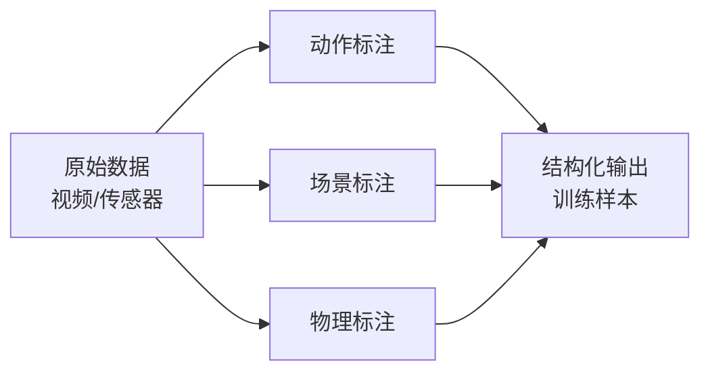

# 02-Annotation: 标注层

## §0 — One-liner

从原始数据到结构化训练数据——Schema设计、标注标准与质量控制。

## §1 — Concept Map

## §2 — Layer Responsibilities

本层回答：**标注什么？怎么标注？如何保证质量？**

| 标注类型 | 内容 | 典型标准 |
|----------|------|----------|
| 动作标注 | 动作空间、时序对齐、执行质量 | Open X-Embodiment |
| 场景标注 | 物体检测、关系、状态变化 | COCO, Visual Genome |
| 物理标注 | 接触点、力、因果关系 | RoboTurk, ARMBench |

## §3 — Topics

| Topic | Status | Description |
|-------|--------|-------------|
| [01-schema-design](01-schema-design.md) | not-started | Schema设计原则与最佳实践 |
| [02-action-annotation](02-action-annotation.md) | not-started | 动作标注标准 |
| [03-scene-annotation](03-scene-annotation.md) | not-started | 场景与物体标注 |
| [04-physics-annotation](04-physics-annotation.md) | not-started | 物理交互标注 |

## §4 — Connections

- **Upstream**: [03-perception](../03-perception/index.md) 提供特征/分割结果
- **Downstream**: [01-foundation](../01-foundation/index.md) 消费标注数据

## §5 — Key Challenges

1. **动作空间统一**: 不同机器人形态的动作表示
2. **时序对齐**: 传感器、视频、动作的时间同步
3. **标注效率**: 自动化 vs 人工标注的权衡

---

*Layer: 02-annotation | Prev: [01-foundation](../01-foundation/index.md) | Next: [03-perception](../03-perception/index.md)*
