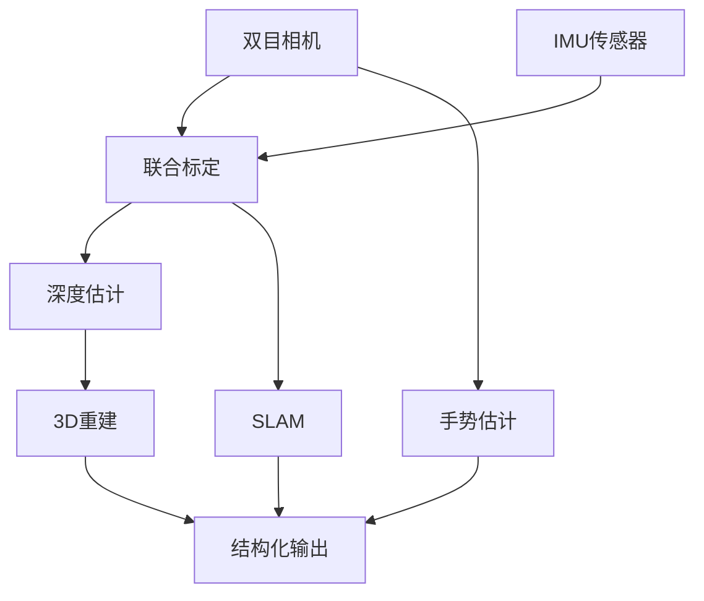

# 03-Perception: 感知层

## §0 — One-liner

从原始传感器到结构化感知——双目+IMU协同、深度估计、SLAM、手势估计、3D重建。

## §1 — Concept Map

## §2 — Layer Responsibilities

本层回答：**如何从传感器获取可用信息？**

| 模块 | 输入 | 输出 | 关键算法 |
|------|------|------|----------|
| 双目+IMU | 双目视频+IMU数据 | 标定参数、位姿 | Kalibr, Basalt |
| 深度估计 | 双目/单目/RGBD | 深度图 | FoundationStereo, RAFT |
| SLAM | 视觉+IMU | 相机轨迹、地图 | ORB-SLAM3, Kimera |
| 手势估计 | Ego视角视频 | 3D手姿 | HaMeR, 100DOH |
| 3D重建 | 多视角/RGBD | 场景/物体重建 | Gaussian Splatting, NeRF |

## §3 — Topics

| Topic | Status | Priority | Description |
|-------|--------|----------|-------------|
| [01-stereo-imu](01-stereo-imu.md) | not-started | **HIGH** | 双目+IMU协同标定 (Kalibr) |
| [02-depth-estimation](02-depth-estimation.md) | not-started | **HIGH** | 深度估计 (FoundationStereo深入研究) |
| [03-slam](03-slam.md) | not-started | **HIGH** | SLAM系统 |
| [04-hand-pose](04-hand-pose.md) | not-started | medium | 手势估计 |
| [05-3d-reconstruction](05-3d-reconstruction.md) | not-started | medium | 3D重建 |
| [06-sensor-fusion](06-sensor-fusion.md) | not-started | low | 多传感器融合 |

## §4 — Connections

- **Upstream**: [04-data-ecosystem](../04-data-ecosystem/index.md) 提供原始传感器数据
- **Downstream**: [02-annotation](../02-annotation/index.md) 消费感知输出

## §5 — Hardware Dependencies

| 采集范式 | 感知重点 | 典型挑战 |
|----------|----------|----------|
| Ego-centric | SLAM稳定性、手势估计 | 快速运动、遮挡 |
| UMI | 手-物交互检测 | 视野受限 |
| Sim2Real | 域适应 | sim-to-real gap |
| 遥操作 | 双臂标定 | 多相机同步 |

---

*Layer: 03-perception | Prev: [02-annotation](../02-annotation/index.md) | Next: [04-data-ecosystem](../04-data-ecosystem/index.md)*
