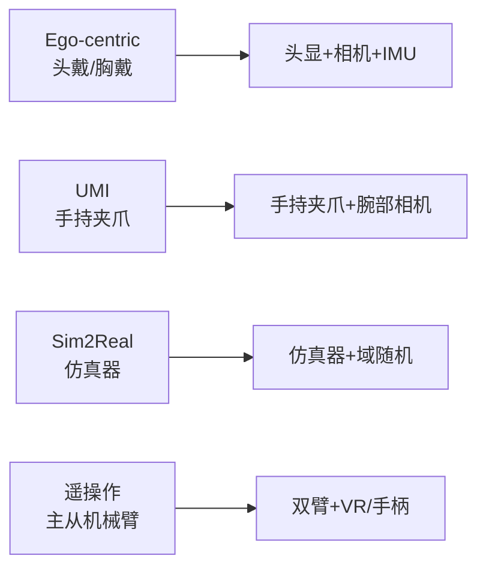

# 04-Data-Ecosystem: 数据生态层

## §0 — One-liner

数据采集范式与硬件配置——Ego-centric、UMI、Sim2Real、遥操作，以及与各范式匹配的硬件设备。

## §1 — Concept Map

## §2 — Layer Responsibilities

本层回答：**用什么设备采集？采集什么样的数据？**

| 范式 | 适用场景 | 数据特性 | 硬件要求 |
|------|----------|----------|----------|
| Ego-centric | 日常操作学习 | 第一人称视角 | 头戴/胸戴相机+IMU |
| UMI | 精细操作技能 | 手-物交互特写 | 手持夹爪+腕部相机 |
| Sim2Real | 大规模预训练 | 无限仿真数据 | 高性能仿真器 |
| 遥操作 | 双臂协作任务 | 专家演示轨迹 | 主从机械臂+VR |

## §3 — Topics

| Topic | Status | Priority | Description |
|-------|--------|----------|-------------|
| [01-ego-collection](01-ego-collection.md) | not-started | **HIGH** | Ego-centric采集方案 |
| [02-umi-systems](02-umi-systems.md) | not-started | **HIGH** | UMI手持系统 |
| [03-sim2real](03-sim2real.md) | not-started | medium | 仿真到真实 |
| [04-teleoperation](04-teleoperation.md) | not-started | medium | 遥操作系统 |
| [05-hardware-matrix](05-hardware-matrix.md) | not-started | **HIGH** | 硬件选型矩阵 |
| [06-data-formats](06-data-formats.md) | not-started | medium | 数据格式对照 |

## §4 — Connections

- **Downstream**: [03-perception](../03-perception/index.md) 处理采集数据
- **To 05-integration**: 采集方案影响系统复杂度和成本

## §5 — Hardware Selection Matrix

| 需求 | Ego | UMI | Sim2Real | 遥操作 |
|------|-----|-----|----------|--------|
| 低成本快速迭代 | ⚠️ | ✅ | ✅✅✅ | ⚠️ |
| 精细操作学习 | ⚠️ | ✅✅✅ | ⚠️ | ✅✅ |
| 双臂协作 | ❌ | ❌ | ✅ | ✅✅✅ |
| 真实物理交互 | ✅✅✅ | ✅✅✅ | ⚠️ | ✅✅✅ |
| 可扩展性 | ✅✅ | ⚠️ | ✅✅✅ | ⚠️ |

---

*Layer: 04-data-ecosystem | Prev: [03-perception](../03-perception/index.md) | Next: [05-integration](../05-integration/index.md)*
