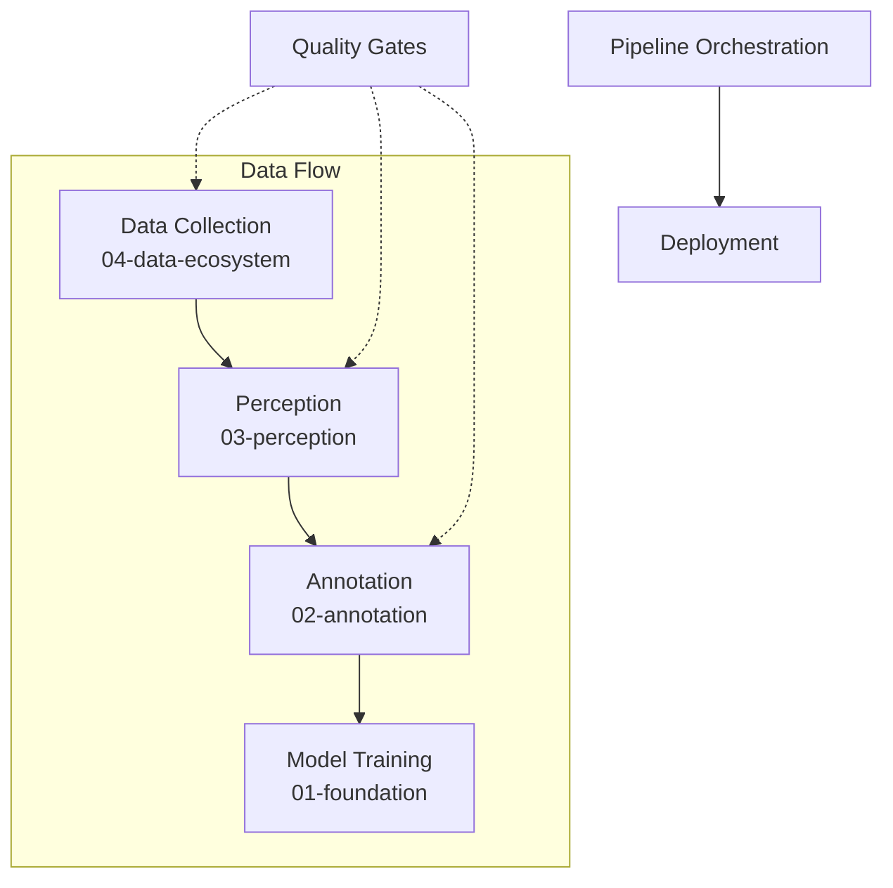

# 05-Integration: 整合层

## §0 — One-liner

端到端数据基础设施设计——流水线模式、质量门控、与跨层整合的最佳实践。

## §1 — Concept Map



## §2 — Layer Responsibilities

本层回答：**如何将所有组件整合为可用系统？**

| 主题 | 问题 | 关键考量 |
|------|------|----------|
| Pipeline模式 | 数据如何流动？ | 批处理vs流式、同步vs异步 |
| 质量门控 | 如何保证数据质量？ | 自动检测、人工抽检、反馈闭环 |
| 系统设计 | 各层如何协同？ | 延迟、容错、可扩展性 |

## §3 — Topics

| Topic | Status | Description |
|-------|--------|-------------|
| [01-pipeline-patterns](01-pipeline-patterns.md) | not-started | 数据流水线设计模式 |
| [02-quality-gates](02-quality-gates.md) | not-started | 质量门控策略 |
| [03-system-design](03-system-design.md) | not-started | 端到端系统设计案例 |

## §4 — Full Stack Dependencies

```
┌─────────────────────────────────────────┐
│  05-integration     ← 你在这一层          │
│  - Pipeline编排                         │
│  - 质量门控                             │
│  - 部署策略                             │
├─────────────────────────────────────────┤
│  01-foundation      模型层              │
│  - 模型选择影响计算资源需求              │
├─────────────────────────────────────────┤
│  02-annotation      标注层              │
│  - 标注质量影响模型性能                  │
├─────────────────────────────────────────┤
│  03-perception      感知层              │
│  - 感知精度影响下游标注                  │
├─────────────────────────────────────────┤
│  04-data-ecosystem  数据生态层          │
│  - 采集方案决定数据特性                  │
└─────────────────────────────────────────┘
```

## §5 — Integration Patterns

| 模式 | 适用场景 | 特点 |
|------|----------|------|
| 批处理流水线 | 离线数据集构建 | 高吞吐、高延迟可接受 |
| 流式处理 | 在线数据增强 | 低延迟、持续处理 |
| 混合模式 | 生产环境 | 批处理+实时校验 |

---

*Layer: 05-integration | Prev: [04-data-ecosystem](../04-data-ecosystem/index.md)*
