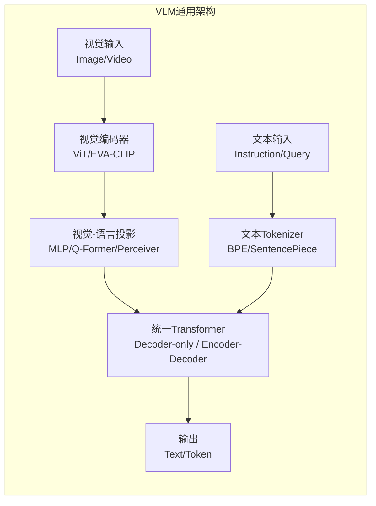

# VLM底座模型：架构、能力与选型

## §0 — One-liner

Vision-Language Model（VLM）是连接视觉感知与自然语言理解的桥梁，为机器人系统提供场景理解、物体识别、空间推理和指令跟随等基础能力。本章节系统梳理主流VLM的技术路线、架构演进与选型策略。

## §1 — 技术演进脉络

### 1.1 三代VLM架构范式

```
第一代（2019-2021）：双塔结构
  CLIP → 独立编码器 + 对比学习对齐
  局限：仅支持全局图文匹配，无法细粒度交互

第二代（2022-2023）：单塔融合结构
  Flamingo/BLIP-2 → 视觉编码器 + 轻量桥接模块 + LLM
  突破：支持生成式任务，但视觉-语言交互浅层

第三代（2023-2026）：原生多模态融合
  GPT-4V/Claude 3/LLaVA-1.5 → 统一Transformer处理图文token
  特征：深度模态融合、高分辨率支持、长上下文理解
```

### 1.2 核心架构组件



| 组件 | 关键技术选择 | 影响维度 |
|------|-----------|---------|
| 视觉编码器 | ViT-L/14, EVA-02-CLIP, SigLIP | 特征质量、分辨率上限 |
| 投影层 | Linear MLP, Q-Former, Perceiver Resampler | 信息压缩率、计算开销 |
| 语言 backbone | LLaMA, Qwen, Mistral, GPT | 语言能力、上下文长度 |
| 训练策略 | 预训练→指令微调→RLHF/DPO | 对齐质量、安全性 |

---

## §2 — 主流模型深度解析

### 2.1 GPT-4V / GPT-4o (OpenAI)

**核心创新点**
- 首个实现工业级多模态推理的闭源模型，支持高分辨率图像（最高约2048x2048）理解
- GPT-4o（omni）实现原生音频-视觉-文本统一建模，延迟降至232ms级别
- 具备出色的OCR、图表理解、空间定位和视觉推理链（Chain-of-Thought）能力

**架构推测**（基于公开信息推断）
```
输入: 图像patch + 文本token
├── 视觉编码器: 可能基于ViT-22B级别架构
├── 模态融合: 早期融合（early fusion），统一Transformer处理
├── 输出: 自回归文本生成
└── 关键特性: 支持多图输入、指代理解（pointing/grounding）
```

**训练数据**
| 维度 | 估计规模 | 说明 |
|------|---------|------|
| 图文对 | 数十亿级 | 包含网页、文档、视频帧 |
| 指令数据 | 百万级 | 多轮对话、复杂推理任务 |
| 安全对齐 | 大规模RLHF | 拒绝有害请求、减少幻觉 |

**性能基准**
- MMMU（大学级多模态推理）: 56.8%（GPT-4V）
- MathVista（数学视觉推理）: 49.9%
- MMBench: 83.4%
- 机器人相关: 可理解自然语言指令并描述场景，但不直接输出动作

**局限性**
- 闭源，无法本地部署，API成本较高
- 无原生动作输出能力，需通过prompt工程桥接
- 物理推理和3D空间理解仍有局限
- 推理延迟不适合高频实时控制（>100ms）

**选型建议**: 适合原型验证、云端推理、需要强语言理解能力的场景

---

### 2.2 Claude 3 / Claude 3.5 Sonnet (Anthropic)

**核心创新点**
- Claude 3系列（Opus/Sonnet/Haiku）提供多层级能力选择
- Claude 3.5 Sonnet在视觉理解上显著提升，支持artifact生成和交互式分析
- 强调安全性和有用性的平衡，幻觉率相对较低

**架构特点**
- 基于Constitutional AI训练，强调自我批评和修正
- 视觉编码器与语言模型深度集成
- 支持超长上下文（200K tokens，测试中支持1M+）

**关键能力矩阵**
| 能力 | Claude 3 Opus | Claude 3.5 Sonnet | Claude 3 Haiku |
|------|--------------|-------------------|----------------|
| 视觉推理 | ★★★★★ | ★★★★★ | ★★★☆☆ |
| 速度 | ★★★☆☆ | ★★★★☆ | ★★★★★ |
| 成本效率 | ★★☆☆☆ | ★★★☆☆ | ★★★★★ |
| 长文档理解 | ★★★★★ | ★★★★★ | ★★★☆☆ |

**与机器人应用的相关性**
- 出色的指令跟随和代码生成能力，适合高层任务规划
- 可解析机器人传感器数据（如摄像头图像）并生成伪代码级控制逻辑
- 支持多轮对话中的视觉上下文维护

**局限性**
- 同样为闭源API服务
- 无原生空间动作输出
- 物理常识推理弱于纯语言任务

---

### 2.3 LLaVA系列 (Microsoft/UC Berkeley)

**核心创新点**
- LLaVA（Large Language and Vision Assistant）是开源VLM的标杆工作
- **LLaVA-1.5**: 通过简单的MLP投影层连接CLIP ViT与Vicuna/LLaMA，实现数据高效训练
- **LLaVA-1.6 (LLaVA-NeXT)**: 支持更高分辨率（336x336→672x672）、更强视觉编码器（ViT-L/336px）、更好的推理能力
- **LLaVA-Video**: 扩展至视频理解，支持长视频序列建模

**架构详解**
```
Image Input (336x336 or 672x672)
    ↓
CLIP ViT-L/14 或 SigLIP SoM-400M (视觉编码器)
    ↓
[CLS] token + patch tokens (256 tokens)
    ↓
Linear Projection Layer (2-layer MLP)
    ↓
与文本token拼接 → LLM (Vicuna/LLaMA-2/3/Mistral)
    ↓
自回归生成回答
```

**训练数据与策略**
| 阶段 | 数据 | 规模 | 目的 |
|------|------|------|------|
| 预训练 | LAION/CC/SBU图文对 + 指令数据 | 595K (1.5) / 1.2M (1.6) | 对齐视觉-语言表示 |
| 指令微调 | LLaVA-Instruct (GPT-4生成) | 158K | 对话能力 |
| 视觉指令 | 包含边界框、指向、推理的复合指令 | 扩展集 | 细粒度理解 |

**性能基准（LLaVA-1.6-34B）**
- MMMU: 51.1%
- MMBench: 80.5%
- SEED-Bench: 71.1%
- 推理速度: 可在单卡A100上运行（约10-20 token/s）

**开源优势**
- 完全开源（权重、代码、数据）
- 训练成本低（8x A100约1-2天可复现）
- 社区生态丰富，支持多种LLM backbone替换
- 可微调适配特定机器人场景

**局限性**
- 相比闭源模型，复杂推理和数学能力有差距
- 高分辨率支持仍不如商业模型
- 需要自行处理安全对齐

---

### 2.4 Qwen-VL / Qwen2-VL (Alibaba)

**核心创新点**
- Qwen-VL是中文语境下最强的开源VLM之一
- **Qwen2-VL**（2024）引入Naive Dynamic Resolution，支持任意分辨率图像输入
- 支持多图输入、视频理解、文档解析和 grounding（指代定位）
- 具备原生工具调用和代码解释能力

**架构特色**
```
Qwen2-VL Architecture:
├── Vision Encoder: ViT-DeepSeek (约675M参数)
├── Window Attention: 处理高分辨率图像
├── M-RoPE (Multi-modal Rotary Position Embedding): 统一时空位置编码
├── 3D ViT: 视频作为3D token序列处理
└── LLM Backbone: Qwen2 (0.5B/7B/72B)
```

**关键技术创新**
| 创新点 | 说明 | 影响 |
|--------|------|------|
| Naive Dynamic Resolution | 图像按固定patch大小切分，不强制resize | 保持原图信息，提升细粒度理解 |
| M-RoPE | 扩展RoPE到2D图像和3D视频 | 更好的空间关系建模 |
| 统一图像/视频处理 | 视频帧作为图像序列，统一编码 | 简化架构，提升效率 |
| 多语言支持 | 中英双语训练 | 适合中文机器人场景 |

**性能表现（Qwen2-VL-72B）**
- MMMU: 63.7%
- DocVQA: 96.5%
- 中文VQA: 领先开源模型
- 推理: 支持vLLM加速，7B模型可在消费级GPU运行

**机器人应用价值**
- 中文场景理解能力强，适合国内机器人应用
- 文档解析能力可用于读取操作手册、UI界面
- 支持 grounding，可直接输出物体边界框坐标

---

### 2.5 InternVL系列 (Shanghai AI Lab)

**核心创新点**
- InternVL-1.5/2.0/2.5 系列持续推动开源VLM能力边界
- **InternVL2.5**（2024）采用"ViT-MLP-LLM"渐进式扩展策略
- 支持8K图像输入和百万级上下文窗口
- 在多个基准上与GPT-4V/Claude 3.5竞争

**架构演进**
```
InternVL 1.0: InternViT-6B + QLLaMA (桥接) + LLaMA
InternVL 1.5: InternViT-6B + MLP + InternLM2/Nous-Hermes
InternVL 2.0: InternViT-8B + 动态分辨率 + InternLM2.5
InternVL 2.5: 渐进式对齐 + 多阶段训练 + 长上下文
```

**训练策略亮点**
- **渐进式对齐**: 从低分辨率到高分辨率逐步训练
- **混合数据策略**: 网页图文、OCR、文档、视频、3D数据混合
- **多任务联合训练**: 描述、问答、定位、分割、OCR统一优化

**性能基准（InternVL2.5-78B）**
- MMMU: 62.3%
- MMBench: 84.2%
- OCRBench: 800+（领先）
- 支持工具调用和代码解释

**部署特性**
- 提供多种尺寸（2B/4B/8B/26B/40B/78B）
- 支持AWQ/GPTQ量化，降低显存需求
- 与LMDeploy/vLLM兼容

---

### 2.6 CogVLM / CogAgent (THUDM)

**核心创新点**
- CogVLM在VLM中引入视觉专家模块（Visual Expert），实现深层视觉-语言融合
- **CogAgent** 专为GUI理解和导航设计，支持高分辨率（1120x1120）图像输入
- 独特的"三明治"架构：在注意力层和FFN层都引入视觉专家

**架构详解**
```
CogVLM Architecture (Sandwich Structure):
Text Embedding ───────────────────────┐
                                      ├──→ Multi-Head Attention
Visual Embedding ──→ Visual Expert ───┘   (with visual bias)
                                      ├──→ FFN
Visual Embedding ──→ Visual Expert ───┘   (with visual FFN)
                                      └──→ Output
```

**关键特性**
| 特性 | CogVLM | CogAgent |
|------|--------|----------|
| 分辨率 | 490x490 | 1120x1120 |
| 视觉专家 | 注意力+FFN双层 | 增强版+高分辨率适配 |
| 专长 | 通用VLM | GUI操作、屏幕理解 |
| 参数 | 17B | 19B |

**机器人应用价值**
- CogAgent的GUI理解能力可迁移至机器人操作面板识别
- 高分辨率支持有助于精细物体操作场景
- 开源可微调

---

## §3 — 综合对比与选型矩阵

### 3.1 模型能力全景对比

| 维度 | GPT-4V | Claude 3.5 | LLaVA-1.6-34B | Qwen2-VL-72B | InternVL2.5-78B | CogAgent |
|------|--------|-----------|---------------|--------------|-----------------|----------|
| **开源程度** | 闭源API | 闭源API | 完全开源 | 完全开源 | 完全开源 | 完全开源 |
| **视觉推理** | ★★★★★ | ★★★★★ | ★★★★☆ | ★★★★★ | ★★★★★ | ★★★★☆ |
| **OCR/文档** | ★★★★★ | ★★★★☆ | ★★★★☆ | ★★★★★ | ★★★★★ | ★★★★★ |
| **空间定位** | ★★★★☆ | ★★★★☆ | ★★★☆☆ | ★★★★☆ | ★★★★☆ | ★★★★☆ |
| **多语言** | ★★★★☆ | ★★★★☆ | ★★★☆☆ | ★★★★★ | ★★★★☆ | ★★★☆☆ |
| **推理速度** | API依赖 | API依赖 | 中等 | 快(vLLM) | 中等 | 中等 |
| **微调成本** | N/A | N/A | 低 | 低 | 中等 | 低 |
| **上下文长度** | 128K | 200K | 4K-32K | 128K | 1M | 8K |
| ** grounding** | 有限 | 有限 | 支持 | 支持 | 支持 | 支持 |

### 3.2 部署成本对比

| 模型 | 典型部署方式 | 显存需求(推理) | 显存需求(微调) | 延迟(估算) |
|------|------------|-------------|--------------|-----------|
| GPT-4V | API | N/A | N/A | 0.5-2s |
| Claude 3.5 | API | N/A | N/A | 0.3-1s |
| LLaVA-1.6-7B | 本地 | ~16GB | ~40GB | 50-100ms |
| LLaVA-1.6-34B | 本地/A100 | ~80GB | ~200GB | 200-500ms |
| Qwen2-VL-7B | 本地 | ~16GB | ~40GB | 30-80ms |
| Qwen2-VL-72B | 本地/多卡 | ~160GB | ~400GB | 150-400ms |
| InternVL2-8B | 本地 | ~20GB | ~50GB | 40-100ms |
| InternVL2-40B | 本地/多卡 | ~100GB | ~250GB | 150-350ms |

### 3.3 机器人场景选型决策矩阵

```
┌─────────────────────────────────────────────────────────────────────┐
│                    VLM选型决策树                                      │
├─────────────────────────────────────────────────────────────────────┤
│                                                                      │
│  Q1: 是否需要本地部署？                                               │
│   ├── 否 → 优先考虑 GPT-4V / Claude 3.5（能力最强）                    │
│   └── 是 → Q2                                                        │
│                                                                      │
│  Q2: 中文场景是否为主？                                               │
│   ├── 是 → Qwen2-VL 系列（中文理解最佳）                              │
│   └── 否 → Q3                                                        │
│                                                                      │
│  Q3: 是否需要GUI/屏幕理解？                                           │
│   ├── 是 → CogAgent（高分辨率GUI专长）                                │
│   └── 否 → Q4                                                        │
│                                                                      │
│  Q4: 文档/OCR需求是否重要？                                           │
│   ├── 是 → InternVL2.5（OCRBench领先）                               │
│   └── 否 → Q5                                                        │
│                                                                      │
│  Q5: 资源受限（单卡消费级GPU）？                                       │
│   ├── 是 → LLaVA-1.6-7B 或 Qwen2-VL-7B（轻量高效）                    │
│   └── 否 → InternVL2.5-40B 或 Qwen2-VL-72B（能力最大化）               │
│                                                                      │
└─────────────────────────────────────────────────────────────────────┘
```

---

## §4 — 与DVAS项目的关联

### 4.1 数据需求映射

VLM作为DVAS系统的"眼睛+大脑"，其数据需求直接影响采集策略：

| VLM能力 | DVAS数据需求 | 采集方式 |
|---------|-------------|---------|
| 场景描述 | 场景图像+描述文本 | 众包标注、GPT-4V辅助生成 |
| 物体识别 | 物体图像+类别标签 | 自动检测+人工校验 |
| 空间关系 | 多视角图像+关系描述 | 结构化采集（固定机位） |
| 指令跟随 | 指令文本+对应场景 | 遥操作记录+语言标注 |
| 细粒度属性 | 物体局部图像+属性描述 | 特写采集+详细标注 |

### 4.2 关键建议

1. **分层数据策略**: 使用闭源VLM（GPT-4V/Claude）生成高质量训练数据，用于微调开源VLM
2. **领域适配**: 在通用VLM基础上，用DVAS采集的机器人场景数据做LoRA/QLoRA微调
3. **多模型协同**: 轻量VLM（7B级别）用于实时感知，大VLM（70B+）用于复杂推理
4. ** grounding 数据**: 采集带边界框标注的指令数据，支持VLM输出空间位置信息

---

## §5 — 技术趋势与展望

### 5.1 2025-2026关键趋势

| 趋势 | 说明 | 对DVAS影响 |
|------|------|-----------|
| 原生多模态 | 音频-视觉-文本-动作统一建模 | 为VLA发展铺平道路 |
| 高分辨率普及 | 4K+图像理解成为标配 | 需要更高质量采集设备 |
| 视频理解增强 | 长视频时序推理能力提升 | 视频采集重要性提升 |
| 端侧部署 | 3B-7B模型手机级运行 | 边缘机器人部署成为可能 |
| 世界模型融合 | VLM + World Model联合训练 | 物理推理能力质的飞跃 |

### 5.2 选型时间线建议

- **即刻可用**: Qwen2-VL-7B/InternVL2-8B（本地部署）+ GPT-4V API（云端）
- **3个月内**: 微调领域适配版本（LoRA）
- **6-12个月**: 关注VLM→VLA的演进，准备动作数据对接

---

## §6 — 参考资源

| 资源 | 链接 | 说明 |
|------|------|------|
| LLaVA GitHub | https://github.com/haotian-liu/LLaVA | 开源VLM标杆 |
| Qwen2-VL | https://huggingface.co/Qwen/Qwen2-VL | 阿里开源VLM |
| InternVL | https://github.com/OpenGVLab/InternVL | 上海AILab |
| CogVLM | https://github.com/THUDM/CogVLM | 清华开源 |
| VLM Leaderboard | https://rank.opencompass.org.cn/leaderboard-multimodal | 中文评测 |
| Paper: LLaVA-NeXT | arXiv:2401.06185 | 技术细节 |
| Paper: Qwen2-VL | arXiv:2409.12191 | 技术细节 |

---

*Layer: 01-foundation | Topic: 01-vlm | Next: [02-world-model](02-world-model.md)*
