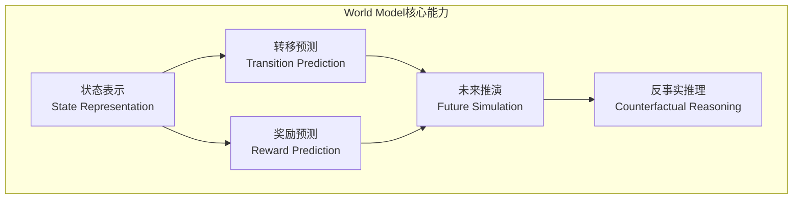
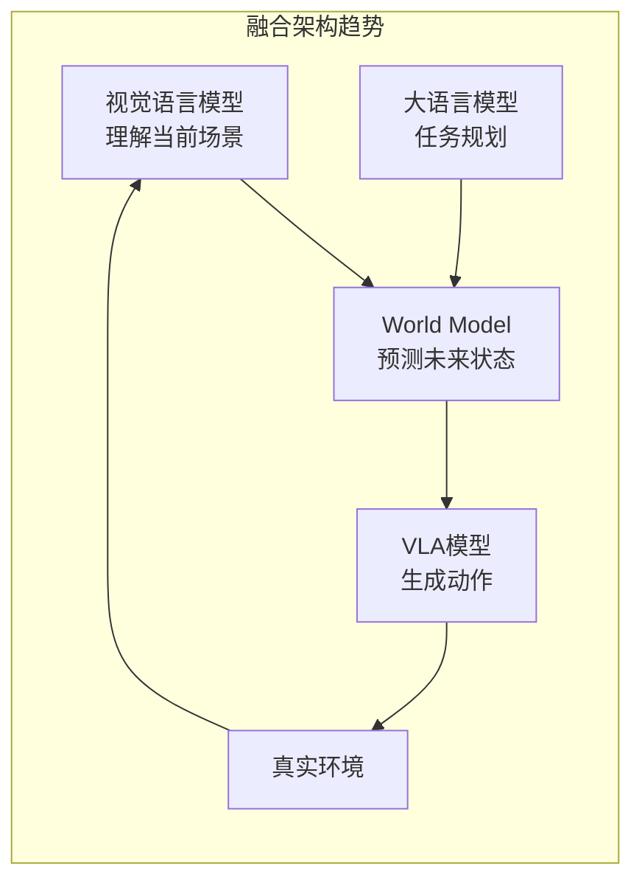

# World Model：状态预测、物理建模与机器人应用

## §0 — One-liner

World Model是智能体对环境的内部模拟器，能够预测未来状态、理解物理规律、支持反事实推理。本章节系统梳理从Ha & Schmidhuber的经典World Model到Genie 2、Sora、Cosmos等前沿工作，分析其在机器人领域的应用潜力与局限。

## §1 — 核心概念与定义

### 1.1 什么是World Model

World Model是智能系统对环境的内部表示，包含三个核心能力：



| 能力 | 定义 | 机器人场景示例 |
|------|------|--------------|
| 状态表示 | 将感官输入压缩为低维状态向量 | 将摄像头画面压缩为"桌面状态" |
| 转移预测 | 预测动作导致的状态变化 | 预测"推杯子"后杯子的位置 |
| 奖励预测 | 预测状态的价值/目标达成度 | 预测当前操作是否接近"倒水成功" |
| 反事实推理 | 模拟未执行动作的结果 | "如果向左推而不是向右推会怎样" |

### 1.2 World Model vs VLM vs VLA

```
┌─────────────────────────────────────────────────────────────────────┐
│                        能力三角关系                                  │
├─────────────────────────────────────────────────────────────────────┤
│                                                                     │
│                    VLM (理解现在)                                    │
│                         ▲                                          │
│                        / \                                         │
│                       /   \                                        │
│            视觉理解   /     \  动作生成                             │
│                     /       \                                      │
│                    /         \                                     │
│                   ▼           ▼                                    │
│           World Model ──────→ VLA                                 │
│           (预测未来)         (执行动作)                              │
│                                                                     │
│  关系说明:                                                          │
│  • VLM提供当前场景的语义理解                                        │
│  • World Model提供物理预测和模拟能力                                │
│  • VLA将理解转化为具体动作                                         │
│  • World Model + VLM → 更强的VLA（理解+预测+执行）                  │
│                                                                     │
└─────────────────────────────────────────────────────────────────────┘
```

| 维度 | VLM | World Model | VLA |
|------|-----|-------------|-----|
| 时间维度 | 静态/当前 | 动态/未来 | 当前→动作 |
| 核心输出 | 语义描述 | 状态预测 | 控制信号 |
| 物理理解 | 表面级 | 深度级 | 任务级 |
| 数据需求 | 图文对 | 视频序列/交互轨迹 | 动作轨迹 |
| 训练目标 | 描述/问答 | 预测/重建 | 模仿/强化学习 |
| 可解释性 | 高（语言） | 中（隐状态） | 低（端到端） |

---

## §2 — 经典与前沿模型深度解析

### 2.1 World Models (Ha & Schmidhuber, 2018)

**核心创新点**
- 开创性提出"学习的环境模型 + 在模型中规划"的范式
- 使用VAE编码观测为低维隐状态，MDN-RNN预测状态转移
- 在CarRacing和VizDoom中展示：在梦境（dream）中训练策略

**架构详解**
```
Observation (64x64x3) ──→ VAE Encoder ──→ z (32-dim latent)
                                              ↓
Action (a) ─────────────────────────→ MDN-RNN ──→ z_next
                                              ↓
                                         VAE Decoder ──→ Predicted Observation
                                              ↓
                                         Controller (线性层) ──→ Action
```

**关键组件**
| 组件 | 技术 | 作用 |
|------|------|------|
| VAE | ConvVAE | 将图像压缩为32维隐向量 |
| MDN-RNN | Mixture Density Network + LSTM | 预测隐状态转移分布 |
| Controller | 线性策略 | 从隐状态到动作的映射 |

**历史意义与局限**
- **意义**: 证明可以在学习的World Model中训练策略，大幅减少真实环境交互
- **局限**: 
  - 仅在简单2D游戏环境有效
  - VAE重建质量有限，丢失细节
  - 长期预测发散（error accumulation）
  - 无法处理复杂物理交互

---

### 2.2 DreamerV3 (Danijar Hafner et al., 2023)

**核心创新点**
- Dreamer系列第三代，在离散和连续控制任务上达到SOTA
- 使用RSSM（Recurrent State-Space Model）替代VAE+MDN-RNN
- 引入离散+连续混合隐状态，提升长期预测稳定性
- 在Atari、DMC、Crafter等基准上超越SAC、PPO等无模型方法

**架构详解**
```
RSSM (Recurrent State-Space Model):
├── Deterministic Path: h_t = GRU(h_{t-1}, z_{t-1}, a_{t-1})
├── Stochastic Path: z_t ~ p(z_t | h_t) (离散/连续混合)
├── Observation Model: x_t ~ p(x_t | h_t, z_t)
├── Reward Model: r_t = f(h_t, z_t)
├── Continue Model: c_t = f(h_t, z_t) (episode终止预测)
└── Actor-Critic: 在隐空间中训练策略
```

**关键技术创新**
| 创新 | 说明 | 效果 |
|------|------|------|
| Symlog预测 | 对奖励和值函数使用对称对数变换 | 稳定大值范围预测 |
| 离散+连续隐状态 | 混合表示，兼顾确定性和不确定性 | 提升预测精度 |
| KL平衡 | 动态调整KL散度权重 | 防止后验坍塌 |
| 归一化 | 对输入和梯度进行归一化 | 跨任务超参数通用 |

**性能基准**
- Atari 55个游戏：人类水平以上（无需调整超参数）
- DeepMind Control Suite：SOTA样本效率
- Crafter：首次达到专家级表现

**机器人应用潜力**
- **样本效率**: 比无模型RL少10-100倍交互数据
- **安全**: 可在模拟中测试危险动作
- **规划**: 支持MPC（模型预测控制）风格的动作选择
- **局限**: 当前主要在模拟环境验证，真实机器人迁移仍具挑战

---

### 2.3 IRIS (Micheli et al., 2023)

**核心创新点**
- Image-based Reinforcement learning with Implicit State
- 使用离散token表示图像（基于VQ-VAE），Transformer预测未来token
- 将World Model与RL结合，在Atari上达到数据高效学习

**架构特点**
```
Image ──→ VQ-VAE Encoder ──→ Discrete Tokens (16x16 grid)
                                    ↓
Action ──→ Token Embedding ──→ Transformer (causal)
                                    ↓
                              Predict Next Tokens
                                    ↓
                         VQ-VAE Decoder ──→ Predicted Image
```

**与机器人相关性**
- 离散表示天然适合与语言模型结合
- Transformer架构可扩展至大规模数据
- 但当前仅在Atari验证，高维连续控制任务未充分探索

---

### 2.4 Sora (OpenAI, 2024)

**核心创新点**
- 基于DiT（Diffusion Transformer）的大规模视频生成模型
- 将视频压缩为时空patch，Transformer进行扩散去噪
- 支持文本到视频、图像到视频、视频编辑、视频拼接
- 展现出涌现的物理世界模拟能力（流体、刚体、光影）

**架构推测**
```
Text Prompt ──→ T5/CLIP Text Encoder ──→ Text Embeddings
                                              ↓
Video/Videos ──→ VAE Encoder ──→ Spacetime Latent Patches
                                              ↓
                              DiT (Diffusion Transformer)
                              ├── 噪声输入
                              ├── 文本条件
                              └── 时间步条件
                                              ↓
                              Denoised Latents ──→ VAE Decoder ──→ Video
```

**关键参数（推测）**
| 维度 | 估计值 | 说明 |
|------|--------|------|
| 模型规模 | 数十亿参数 | DiT Transformer |
| 训练数据 | 数百万小时视频 | 含标注视频 |
| 分辨率 | 最高1920x1080 | 可变长宽比 |
| 时长 | 最长60秒 | 可扩展 |

**作为World Model的潜力与争议**

| 支持观点 | 反对观点 |
|---------|---------|
| 能生成符合物理规律的视频（物体持久性、重力） | 非因果模型，无法主动干预和预测动作效果 |
| 隐式学习了3D几何和光照模型 | 经常出现物理错误（穿模、变形） |
| 可零样本生成多样化场景 | 无法输出可操作的隐状态表示 |
| 为训练数据生成提供可能 | 计算成本极高，无法实时运行 |

**对机器人的价值**
- **数据生成**: 为罕见场景生成训练视频（如"杯子从桌上掉落"）
- **场景理解**: 通过生成验证对物理规律的理解
- **局限**: 无法直接用于控制，需与其他模型结合

---

### 2.5 Genie 2 (Google DeepMind, 2024)

**核心创新点**
- 首个可交互的生成式World Model
- 从单张图像生成可交互的3D环境，支持键盘/鼠标控制
- 基于Latent Diffusion Model，将动作作为条件输入
- 支持平台游戏、机器人操作等多种交互模式

**架构特点**
```
Prompt Image / Sketch ──→ Image Encoder ──→ Latent Representation
                                                  ↓
Action (keyboard/mouse) ──→ Action Embedding ──→ Latent Diffusion Model
                                                  ↓
                                              Next Frame Latent
                                                  ↓
                                         Decoder ──→ Next Frame
```

**与Sora的关键区别**
| 维度 | Sora | Genie 2 |
|------|------|---------|
| 交互性 | 被动生成 | 主动交互（动作条件） |
| 控制粒度 | 文本级 | 动作级（按键/鼠标） |
| 一致性 | 时间一致性较好 | 长期一致性挑战 |
| 3D理解 | 隐式 | 显式支持视角变化 |
| 应用方向 | 内容创作 | 训练环境、游戏AI |

**机器人应用潜力**
- **模拟训练环境**: 从真实场景照片生成可交互模拟器
- **Sim2Real**: 在Genie生成的环境中训练策略
- **数据增强**: 生成多样化操作场景
- **当前局限**: 实时性不足，动作空间与机器人不匹配

---

### 2.6 Cosmos (NVIDIA, 2025)

**核心创新点**
- NVIDIA推出的开源World Model平台，包含多个模型尺寸
- 专为物理AI（Physical AI）设计，强调物理一致性
- 包含Tokenizer、Diffusion Model、Autoregressive Model三大部分
- 支持从文本/图像/视频生成物理一致的虚拟世界

**技术架构**
```
Cosmos Platform:
├── Cosmos-Tokenizer
│   ├── Continuous Tokenizer (CV8x8x8)
│   └── Discrete Tokenizer (DV8x8x8)
├── Cosmos-Diffusion (7B/14B)
│   ├── Text-to-World
│   ├── Video-to-World
│   └── World-to-World
├── Cosmos-Autoregressive (4B/12B)
│   ├── Token-based generation
│   └── Action-conditioned prediction
└── Cosmos-Prompt-Upsampler (用于提升提示质量)
```

**关键特性**
| 特性 | 说明 | 机器人价值 |
|------|------|----------|
| 物理一致性 | 强调牛顿力学、材料属性 | 更适合机器人交互模拟 |
| 开源 | 权重、代码、数据开源 | 可定制和微调 |
| 多尺度 | 从4B到14B多种尺寸 | 根据资源灵活选择 |
| Tokenizer | 高效视频压缩 | 降低训练和推理成本 |
| 多模态条件 | 文本/图像/视频/动作 | 支持多种输入方式 |

**与NVIDIA生态整合**
- 与Omniverse深度集成，支持USD格式
- 可利用NVIDIA GPU集群进行大规模训练
- 为Isaac Sim等机器人仿真平台提供生成能力

---

## §3 — 综合对比分析

### 3.1 模型能力矩阵

| 维度 | Ha&Schmidhuber | DreamerV3 | IRIS | Sora | Genie 2 | Cosmos |
|------|---------------|-----------|------|------|---------|--------|
| **开源** | 是 | 是 | 是 | 否 | 否 | 是 |
| **可交互** | 是 | 是 | 是 | 否 | 是 | 是 |
| **3D支持** | 否 | 部分 | 否 | 隐式 | 是 | 是 |
| **物理精度** | 低 | 中 | 低 | 中 | 中 | 高 |
| **真实环境验证** | 否 | 部分 | 否 | 否 | 否 | 计划中 |
| **实时性** | 是 | 是 | 部分 | 否 | 否 | 部分 |
| **动作空间** | 连续 | 连续 | 离散 | N/A | 离散按键 | 连续/离散 |
| **长期预测** | 短 | 中 | 中 | 长 | 中 | 长 |
| **机器人适用** | 理论 | 高 | 中 | 低 | 中 | 高 |

### 3.2 物理建模精度评估

```
物理建模能力阶梯:

Level 1 ──→ 像素级一致性（外观匹配）
    │         [Ha&Schmidhuber, IRIS]
    ↓
Level 2 ──→ 物体持久性（物体不凭空消失）
    │         [DreamerV3, Sora]
    ↓
Level 3 ──→ 刚体动力学（碰撞、重力、摩擦）
    │         [Sora, Genie 2]
    ↓
Level 4 ──→ 软体/流体物理（形变、流动）
    │         [Sora部分, Cosmos]
    ↓
Level 5 ──→ 物理参数可提取（质量、刚度等可量化）
              [当前所有模型均未达到]
```

### 3.3 在机器人领域的应用潜力分级

| 应用场景 | 最佳候选 | 成熟度 | 关键挑战 |
|----------|---------|--------|----------|
| **数据增强** | Sora/Cosmos | ★★★☆☆ | 生成数据与真实分布差异 |
| **策略预训练** | DreamerV3 | ★★★★☆ | 真实环境迁移 |
| **模拟环境** | Genie 2/Cosmos | ★★☆☆☆ | 实时性、物理精度 |
| **动作规划** | DreamerV3 | ★★★☆☆ | 高维动作空间、长程规划 |
| **风险评估** | DreamerV3 | ★★★☆☆ | 不确定性量化 |
| **Sim2Real** | Cosmos+Omniverse | ★★☆☆☆ | 域迁移、物理一致性 |

---

## §4 — World Model与VLM/VLA的关系

### 4.1 融合趋势

当前前沿方向是将World Model与VLM/VLA结合，形成"理解-预测-执行"闭环：



### 4.2 具体融合方式

| 融合方式 | 代表工作 | 机制 | 优势 |
|----------|---------|------|------|
| VLM作为World Model输入 | Sora+GPT-4V | 用VLM理解场景，指导视频生成 | 语义控制生成 |
| World Model增强VLA | DreamerV3+RT-2 | 用World Model做数据增强和规划 | 提升样本效率 |
| 统一架构 | 前沿探索 | 单一模型同时做理解和预测 | 端到端优化 |
| 分层架构 | 本项目的推荐方向 | VLM理解→World Model预测→VLA执行 | 模块化、可解释 |

### 4.3 对DVAS项目的启示

```
DVAS中的World Model定位:

┌─────────────────────────────────────────────────────────────┐
│                      DVAS数据流                              │
├─────────────────────────────────────────────────────────────┤
│                                                             │
│   采集数据 ──→ VLM理解 ──→ World Model学习 ──→ VLA训练     │
│      │           │              │                │          │
│      │           │              │                │          │
│      ▼           ▼              ▼                ▼          │
│   视频序列    场景描述      物理规律        动作策略       │
│   动作轨迹    物体关系      状态转移        控制信号       │
│                                                             │
│   World Model的核心价值:                                     │
│   1. 从采集数据中学习环境动态模型                            │
│   2. 生成合成数据扩充训练集                                  │
│   3. 支持"如果...会怎样"的反事实分析                         │
│   4. 评估动作安全性（在模拟中测试）                          │
│                                                             │
└─────────────────────────────────────────────────────────────┘
```

---

## §5 — 数据需求与采集策略

### 5.1 World Model特有的数据需求

| 数据类型 | 用途 | 采集方式 | 规模需求 |
|----------|------|----------|----------|
| 视频序列 | 学习状态转移 | 固定机位录制 | 百万小时级 |
| 动作-观测对 | 学习动作效果 | 遥操作+同步记录 | 十万级 |
| 物理交互视频 | 学习物体动力学 | 多视角+高速相机 | 万级 |
| 多轨迹对比 | 学习最优策略 | 同一任务多次执行 | 千级 |
| 失败案例 | 学习边界条件 | 记录失败操作 | 千级 |

### 5.2 与DVAS数据生态的衔接

```
DVAS数据 → World Model训练流程:

1. 原始采集
   ├── 视频流（30/60fps）
   ├── 动作日志（关节角度/末端位姿）
   ├── 传感器数据（力/触觉）
   └── 任务标注（成功/失败/阶段）

2. 预处理
   ├── 视频编码（Cosmos Tokenizer）
   ├── 动作离散化/标准化
   ├── 状态标注（VLM辅助）
   └── 片段切分（episode分割）

3. 训练
   ├── 自监督预训练（视频预测）
   ├── 动作条件微调
   └── 物理一致性约束

4. 应用
   ├── 数据生成（罕见场景）
   ├── 策略评估（模拟测试）
   └── 不确定性量化（风险评估）
```

---

## §6 — 技术趋势与展望

### 6.1 2025-2026关键发展方向

| 方向 | 描述 | 预期突破 |
|------|------|----------|
| 物理一致性 | 牛顿力学约束嵌入生成模型 | 更可靠的机器人模拟 |
| 实时World Model | 边缘设备上的轻量模型 | 在线适应和学习 |
| 多模态World Model | 视觉+触觉+听觉统一建模 | 更丰富的环境理解 |
| 可微分物理 | 物理引擎与神经网络结合 | 梯度传播优化 |
| 世界模型即服务 | 预训练World Model API | 降低使用门槛 |

### 6.2 对DVAS项目的建议

1. **短期（3个月）**: 关注Cosmos开源进展，准备视频数据采集pipeline
2. **中期（6个月）**: 基于DVAS采集数据训练轻量World Model（DreamerV3级别）
3. **长期（12个月）**: 探索VLM+World Model+VLA的端到端融合架构

---

## §7 — 参考资源

| 资源 | 链接/引用 | 说明 |
|------|----------|------|
| World Models (Ha & Schmidhuber) | arXiv:1803.10122 | 开创性工作 |
| DreamerV3 | arXiv:2301.04104 | 数据高效RL |
| IRIS | arXiv:2305.15075 | Transformer-based WM |
| Sora Technical Report | OpenAI, 2024 | 视频生成 |
| Genie | arXiv:2402.15391 | 可交互环境生成 |
| Cosmos | NVIDIA, 2025 | 物理AI平台 |
| Dreamer官方实现 | https://github.com/danijar/dreamer | 开源代码 |

---

*Layer: 01-foundation | Topic: 02-world-model | Next: [03-vla](03-vla.md)*
