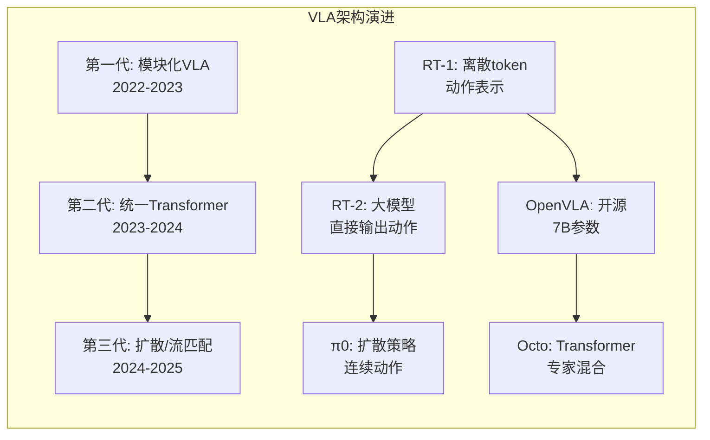

# VLA端到端模型：从RT-1到π0的演进与选型

## §0 — One-liner

Vision-Language-Action（VLA）模型将视觉感知、语言指令和动作执行统一为端到端架构，是机器人领域最具变革性的技术方向之一。本章节系统梳理从RT-1到π0的关键模型，分析其架构差异、数据需求和部署特性。

## §1 — VLA技术演进脉络

### 1.1 从模块化到端到端

```
传统机器人流水线（2010-2022）:
Camera → 目标检测 → 位姿估计 → 运动规划 → 控制器 → 执行
         [YOLO]     [ICP]       [RRT]      [PID]
         └─ 各模块独立训练，误差累积，难以端到端优化

VLA端到端（2022-至今）:
Camera + Language ──→ VLA Model ──→ Actions
         └─ 统一训练，端到端优化，自然语言指令直接驱动
```

### 1.2 三代VLA架构范式



| 代际 | 代表模型 | 核心特征 | 动作表示 |
|------|---------|---------|---------|
| 第一代 | RT-1, Gato, BC-Z | 视觉编码+语言编码→MLP→动作 | 连续值/离散token |
| 第二代 | RT-2, OpenVLA, Octo | 大VLM直接输出动作token | 离散token（量化） |
| 第三代 | π0, RDT, Diffusion Policy | 扩散/流匹配生成连续动作 | 连续分布采样 |

---

## §2 — 关键模型深度解析

### 2.1 RT-1 (Google DeepMind, 2022)

**核心创新点**
- 首个大规模端到端机器人Transformer（Robotics Transformer）
- 使用FiLM（Feature-wise Linear Modulation）条件化视觉特征
- 将动作离散化为256个token，自回归预测
- 在130K条机器人操作轨迹上训练，展示跨任务泛化

**架构详解**
```
RT-1 Architecture:
Image 1 (camera view) ──→ EfficientNet-B3 ──→ Visual Tokens (9x9=81)
Image 2 (wrist view)  ──→ EfficientNet-B3 ──→ Visual Tokens (9x9=81)
Language Instruction ──→ Universal Sentence Encoder ──→ Language Embedding
                                                              ↓
                                    FiLM Conditioning ←──────┘
                                                              ↓
                                              TokenLearner (压缩至8 tokens)
                                                              ↓
                                            Transformer Decoder (仅解码器)
                                                              ↓
                                            Action Tokens (离散, 256 bins)
                                                              ↓
                                            De-tokenize → 7-DoF动作
```

**动作表示**
| 维度 | 范围 | 离散化方式 |
|------|------|-----------|
| x, y, z | [-1, 1]m | 256 bins均匀量化 |
| roll, pitch, yaw | [-π, π] | 256 bins均匀量化 |
| gripper | open/close | 2 bins |
| terminate | yes/no | 2 bins |

**训练数据**
- 规模: 130K条轨迹，约720K时间步
- 来源: 13个机器人，17个月采集
- 任务: 700+ 独特指令
- 环境: 厨房、办公室等真实场景

**性能表现**
- 对新任务泛化: 97%成功率（对比BC的70%）
- 对新环境泛化: 显著提升
- 对干扰物鲁棒性: 可忽略无关物体

**局限性**
- 动作空间离散化导致精度损失
- 模型规模较小（35M参数），无法理解复杂语言
- 需要大量真实机器人数据

---

### 2.2 RT-2 (Google DeepMind, 2023)

**核心创新点**
- 将VLM直接用于机器人控制，无需单独的视觉编码器
- 使用PaLI-X（55B参数）或PaLM-E（12B参数）作为backbone
- 动作表示为文本token（如"1.25 0.87 -0.33..."），与语言统一处理
- 展示涌现能力：可执行训练数据中未出现的任务

**架构详解**
```
RT-2 Architecture:
Camera Images ──→ VLM Encoder (PaLI-X/PaLM-E)
                        ↓
                Unified Token Sequence
                ├── Image tokens
                ├── Language instruction tokens
                └── Action tokens (as text)
                        ↓
                Large Language Model (55B params)
                        ↓
                Output: Action string → Parse → 连续动作
```

**关键技术决策**
| 决策 | 实现 | 理由 |
|------|------|------|
| 动作文本化 | "x y z r p y g t" | 利用VLM的文本生成能力 |
| 精度保留 | 保留6位小数 | 避免离散化损失 |
| 多任务训练 | 互联网图文 + 机器人数据 | 提升泛化能力 |
| 推理方式 | CoT（Chain-of-Thought） | 提升复杂任务成功率 |

**性能突破**
- 对新物体泛化: RT-1的3倍成功率
- 对新语义指令: 可理解"拿起即将掉落的物体"
- 涌现能力: 可执行训练数据中未出现的指令组合
- 多语言理解: 支持非英语指令（因PaLI-X多语言能力）

**局限性**
- 推理延迟高（1-3秒/动作），无法实时控制
- 闭源，无法复现
- 需要大规模计算资源（TPU集群）
- 动作精度受文本化限制

---

### 2.3 RT-X (Google DeepMind, 2023)

**核心创新点**
- 跨机器人、跨实验室的大规模数据集（Open X-Embodiment）
- 22种机器人形态，100万+条轨迹，527项技能
- 证明跨embodiment训练可提升单机器人性能

**数据集统计**
| 来源 | 机器人数量 | 轨迹数 | 任务类型 |
|------|----------|--------|---------|
| Google DeepMind | 5 | 244K | 操作、导航 |
| 加州大学伯克利 | 1 | 12K | 操作 |
| 斯坦福 | 1 | 3K | 操作 |
| 其他机构 | 15+ | 750K+ | 多样化 |

**核心发现**
1. **正迁移**: 在其他机器人数据上训练，提升目标机器人性能
2. **涌现能力**: 跨机器人数据训练后，模型展现更好泛化
3. **数据规模效应**: 数据量与性能呈对数线性关系

---

### 2.4 OpenVLA (Stanford/LMNT, 2024)

**核心创新点**
- 首个真正开源的VLA模型（7B参数，Apache 2.0许可）
- 基于Llama 2 + DINOv2视觉编码器
- 支持多种机器人形态（单臂、双臂、轮式）
- 可在消费级GPU（24GB显存）上微调

**架构详解**
```
OpenVLA Architecture:
Images (RGB) ──→ DINOv2 (ViT-L/14) ──→ Image Patches (16x16)
                                              ↓
                                    MLP Projection Layer
                                              ↓
Language Instruction ──→ Llama 2 Tokenizer ──→ Text Tokens
                                              ↓
                                    Concatenate [IMG; TXT] Tokens
                                              ↓
                                    Llama 2 Decoder (7B)
                                              ↓
                                    Action Tokens (discretized)
                                              ↓
                                    De-tokenize → Continuous Actions
```

**关键技术特点**
| 特性 | 实现 | 影响 |
|------|------|------|
| 视觉编码器 | DINOv2 (无监督预训练) | 更好的特征表示 |
| 语言模型 | Llama 2 7B | 开源可商用 |
| 动作离散化 | 均匀量化256 bins | 简单但损失精度 |
| 训练数据 | Open X-Embodiment子集 | 970K条轨迹 |
| 微调支持 | LoRA/QLoRA | 消费级GPU可微调 |

**性能表现**
- 在BridgeData V2上: 与RT-2-X相比，成功率相当
- 对新环境泛化: 优于RT-1基线
- 推理速度: 约50-100ms/动作（A100）

**部署特性**
| 部署方式 | 显存需求 | 适用场景 |
|---------|---------|---------|
| 全量推理 | ~16GB | 服务器部署 |
| INT8量化 | ~8GB | 工作站部署 |
| LoRA微调 | ~24GB | 领域适配 |
| QLoRA微调 | ~12GB | 消费级GPU |

---

### 2.5 Octo (Stanford/Berkeley, 2024)

**核心创新点**
- 基于Transformer的通用机器人策略
- 支持多模态输入（视觉、语言、目标状态）
- 使用Transformer Encoder-Decoder架构
- 支持多种动作表示（连续、离散、diffusion head）

**架构特点**
```
Octo Architecture:
Observation Tokens:
  ├── Image tokens (from ViT)
  ├── Language tokens (from T5)
  └── Proprioception tokens (robot state)
              ↓
      Transformer Encoder (read-only)
              ↓
      Transformer Decoder (causal, with action readout)
              ↓
      Action Head:
        ├── Continuous MLP head
        ├── Discrete token head
        └── Diffusion head (optional)
```

**与OpenVLA的关键区别**
| 维度 | OpenVLA | Octo |
|------|---------|------|
| 架构 | Decoder-only | Encoder-Decoder |
| 动作表示 | 离散token | 连续/离散/扩散 |
| 目标条件 | 语言-only | 语言+目标图像 |
| 训练数据 | Open X-Embedding | 相同 + 自定义 |
| 参数规模 | 7B | 27M-93M (轻量) |
| 推理速度 | 中等 | 快（轻量） |

**机器人应用价值**
- 轻量架构适合实时控制
- 支持目标图像条件（"摆成这个样子"）
- 模块化设计，可替换不同head

---

### 2.6 π0 (Physical Intelligence, 2024)

**核心创新点**
- 首个大规模扩散VLA模型（3B参数）
- 使用流匹配（Flow Matching）生成连续动作
- 支持复杂多步骤任务（如"叠衣服"）
- 在真实机器人上展示长程任务能力

**架构详解**
```
π0 Architecture:
Images + Language ──→ VLM Backbone (SigLIP + PaliGemma)
                              ↓
                      Observation Embedding
                              ↓
                      Diffusion Model (3B)
                      ├── Noise Action (random init)
                      ├── Observation condition
                      └── Timestep embedding
                              ↓
                      Denoised Actions (continuous)
                              ↓
                      7-DoF + Gripper
```

**流匹配（Flow Matching）vs 传统扩散**
| 特性 | DDPM/Diffusion | Flow Matching (π0) |
|------|---------------|-------------------|
| 采样步数 | 通常50-1000 | 通常10-50 |
| 训练目标 | 预测噪声 | 预测速度场 |
| 推理速度 | 慢 | 较快 |
| 动作质量 | 高 | 高，更平滑 |
| 理论简洁性 | 中等 | 高（ODE视角） |

**性能突破**
- 折叠衣服任务: 从0%提升至约60%成功率
- 清理桌面: 可处理10+个物体的复杂场景
- 多步骤任务: 可执行5-10步的连续操作

**训练数据规模**
- 真实机器人数据: 数万小时
- 互联网视觉-语言数据: 用于预训练
- 数据多样性: 家务、工业、办公场景

---

### 2.7 RDT (Robotic Diffusion Transformer, Tsinghua, 2024)

**核心创新点**
- 专为机器人设计的Diffusion Transformer
- 将动作生成建模为条件扩散过程
- 引入Action Chunking（动作分块）提升长程一致性
- 在真实机器人上验证

**架构创新**
```
RDT Architecture:
Observation ──→ Vision Encoder ──→ Visual Tokens
                                         ↓
                              Cross-Attention
                                         ↓
Action Noise ──→ Diffusion Transformer ──→ Denoised Actions
    ↑                                          |
    └──────── Timestep Embedding ←─────────────┘
```

**关键技术点**
| 技术 | 说明 | 效果 |
|------|------|------|
| Action Chunking | 预测未来K步动作而非单步 | 提升动作平滑性 |
| Diffusion Transformer | 用Transformer替代UNet | 更好的长程依赖 |
| 条件化 | 视觉+语言+本体感知联合条件 | 多模态对齐 |

---

### 2.8 Diffusion Policy (Columbia/MIT, 2023)

**核心创新点**
- 将扩散模型引入机器人模仿学习
- 建模动作的条件分布而非单值预测
- 支持多模态动作分布（如"向左或向右均可"）
- 在多个真实机器人任务上验证

**核心思想**
```
传统行为克隆: π(a|s) = deterministic action
Diffusion Policy: π(a|s) = p(a|s) learned via diffusion

优势:
1. 多模态: 可表示"多个正确动作"
2. 平滑: 扩散过程天然生成平滑轨迹
3. 稳定: 避免行为克隆的复合误差
```

**架构**
```
Diffusion Policy:
Observation s ──→ CNN / Transformer Encoder ──→ Observation Embedding
                                                      ↓
                                              UNet / Transformer
                                              ├── Noisy Action a_t^K
                                              ├── Observation condition
                                              └── Timestep k
                                                      ↓
                                              Predicted Noise ε_θ
                                                      ↓
                                              Denoised Action a_t^0
```

**与VLA的关系**
- Diffusion Policy是动作生成模块，可嵌入VLA架构
- π0和RDT可视为"VLM + Diffusion Policy"的融合
- 相比离散token方法，连续生成更适合精细操作

---

## §3 — 综合对比分析

### 3.1 架构对比表

| 维度 | RT-1 | RT-2 | OpenVLA | Octo | π0 | RDT | Diffusion Policy |
|------|------|------|---------|------|-----|-----|-----------------|
| **年份** | 2022 | 2023 | 2024 | 2024 | 2024 | 2024 | 2023 |
| **开源** | 否 | 否 | 是 | 是 | 部分 | 是 | 是 |
| **参数规模** | 35M | 55B | 7B | 27-93M | 3B | 数百M | 可变 |
| **Backbone** | EfficientNet | PaLI-X | Llama 2 | Transformer | PaliGemma | Transformer | UNet/Transformer |
| **动作表示** | 离散token | 文本token | 离散token | 连续/离散 | 扩散(连续) | 扩散(连续) | 扩散(连续) |
| **语言理解** | 弱 | 强 | 中 | 中 | 强 | 中 | 弱 |
| **推理延迟** | ~100ms | 1-3s | ~100ms | ~50ms | ~200ms | ~150ms | ~100ms |
| **训练数据** | 130K | 同RT-1+X | 970K | 970K | 数万小时 | 数千小时 | 可变 |
| **泛化能力** | 中 | 强 | 中 | 中 | 强 | 中 | 中 |
| **实时性** | 是 | 否 | 是 | 是 | 是 | 是 | 是 |
| **微调友好** | N/A | N/A | 是(LoRA) | 是 | 部分 | 是 | 是 |

### 3.2 动作表示方式对比

| 表示方式 | 代表模型 | 优点 | 缺点 | 适用场景 |
|----------|---------|------|------|---------|
| **离散Token** | RT-1, OpenVLA | 简单、与LLM兼容 | 精度损失、动作不连续 | 粗粒度操作 |
| **文本化** | RT-2 | 利用VLM能力 | 精度受限、解析复杂 | 语义丰富任务 |
| **连续值** | Octo | 精度高、平滑 | 需要特殊处理 | 精细操作 |
| **扩散生成** | π0, RDT, DP | 多模态、平滑、精确 | 推理慢、计算量大 | 复杂精细任务 |

### 3.3 部署要求对比

| 模型 | 最小GPU(推理) | 推荐GPU(推理) | 微调GPU | 推理延迟 | 并发能力 |
|------|-------------|-------------|---------|---------|---------|
| RT-1 | 8GB | 16GB | N/A | ~100ms | 高 |
| RT-2 | 80GB+ | TPU集群 | N/A | 1-3s | 低 |
| OpenVLA | 16GB | 24GB | 24GB(LoRA) | ~100ms | 中 |
| Octo | 4GB | 8GB | 16GB | ~50ms | 高 |
| π0 | 24GB | 48GB | 48GB+ | ~200ms | 中 |
| RDT | 12GB | 24GB | 24GB | ~150ms | 中 |
| Diffusion Policy | 4GB | 8GB | 16GB | ~100ms | 高 |

---

## §4 — 选型决策矩阵

### 4.1 按应用场景选型

```
┌─────────────────────────────────────────────────────────────────────┐
│                    VLA选型决策树                                      │
├─────────────────────────────────────────────────────────────────────┤
│                                                                      │
│  Q1: 是否需要复杂语言理解？                                           │
│   ├── 是 → Q2                                                        │
│   └── 否 → Q3                                                        │
│                                                                      │
│  Q2: 是否有充足计算资源？                                             │
│   ├── 是 → RT-2级别（闭源参考）或 π0（开源）                         │
│   └── 否 → OpenVLA（7B可微调）                                       │
│                                                                      │
│  Q3: 是否需要精细操作？                                               │
│   ├── 是 → Diffusion Policy / RDT / π0                              │
│   └── 否 → Q4                                                        │
│                                                                      │
│  Q4: 是否需要实时性？                                                 │
│   ├── 是 → Octo / Diffusion Policy（轻量）                            │
│   └── 否 → OpenVLA（可接受~100ms延迟）                               │
│                                                                      │
│  Q5: 是否需要快速原型验证？                                           │
│   ├── 是 → Diffusion Policy（最易实现）                              │
│   └── 否 → 根据具体需求选择                                          │
│                                                                      │
└─────────────────────────────────────────────────────────────────────┘
```

### 4.2 按资源约束选型

| 资源约束 | 推荐方案 | 理由 |
|---------|---------|------|
| **单卡消费级GPU** (RTX 4090, 24GB) | Diffusion Policy / Octo | 轻量、实时、可微调 |
| **单卡专业级GPU** (A100 40GB) | OpenVLA / RDT | 可运行7B模型，支持微调 |
| **多卡集群** | π0 / 定制VLA | 可训练大模型 |
| **云端API** | RT-2级别参考 | 无需本地部署 |
| **嵌入式设备** (Jetson) | Octo / 蒸馏版DP | 极致轻量化 |

---

## §5 — 与DVAS项目的关联

### 5.1 数据需求映射

| VLA能力 | DVAS数据需求 | 采集策略 |
|---------|-------------|---------|
| 视觉-语言对齐 | 场景图像+自然语言指令 | 遥操作时同步记录 |
| 动作执行 | 关节角度/末端位姿+图像 | 机器人本体传感器 |
| 长程任务 | 多步骤轨迹+中间状态 | 分段标注+任务分解 |
| 泛化能力 | 多场景、多物体、多视角 | 系统化采集矩阵 |
| 精细操作 | 高频传感器数据(100Hz+) | 高速采集设备 |

### 5.2 DVAS数据 → VLA训练流程

```
DVAS采集数据:
├── 视频流 (30-60fps RGB)
├── 深度图 (可选)
├── 机器人状态 (关节角、末端位姿)
├── 力/触觉数据 (可选)
├── 语言指令 (自然语言)
└── 任务标注 (成功/失败、阶段标记)

预处理:
├── 图像编码 (ViT patch)
├── 动作离散化/标准化
├── 指令清洗和规范化
└── 数据增强 (颜色抖动、视角变化)

训练:
├── 预训练 (VLM初始化)
├── 行为克隆 (BC)
├── 扩散训练 (如使用DP)
└── 微调 (LoRA/QLoRA)

评估:
├── 成功率
├── 泛化测试
└── 实时性测试
```

### 5.3 关键建议

1. **数据质量 > 数量**: VLA对数据质量敏感，优先保证标注准确性
2. **多模态对齐**: 确保视觉、语言、动作三者时间对齐
3. **动作表示选择**: 
   - 快速原型 → Diffusion Policy
   - 生产部署 → 根据延迟要求选择
4. **模型规模**: 从7B级别开始，根据效果决定是否扩展
5. **持续学习**: 设计在线学习机制，随采集数据增长持续提升

---

## §6 — 技术趋势与展望

### 6.1 2025-2026发展方向

| 方向 | 描述 | 预期影响 |
|------|------|----------|
| 更大规模 | 数十亿到百亿参数VLA | 更强泛化，更高成本 |
| 多模态扩展 | 触觉、力觉、音频输入 | 更丰富的感知 |
| 世界模型融合 | VLA + World Model联合训练 | 预测+执行一体化 |
| 端侧部署 | 3-7B模型边缘运行 | 低延迟、隐私保护 |
| 持续学习 | 在线适应新任务 | 减少重复采集 |
| 仿真预训练 | Sim2Real大规模应用 | 降低真实数据需求 |

### 6.2 对DVAS项目的建议

| 阶段 | 时间 | 行动 | 目标模型 |
|------|------|------|---------|
| 短期 | 1-3月 | 基于Diffusion Policy快速原型 | DP |
| 中期 | 3-6月 | 部署OpenVLA，领域微调 | OpenVLA 7B |
| 长期 | 6-12月 | 探索π0级别扩散VLA | π0 / 自研 |
| 远期 | 12月+ | VLA + World Model融合 | 下一代架构 |

---

## §7 — 参考资源

| 资源 | 链接/引用 | 说明 |
|------|----------|------|
| RT-1 | arXiv:2212.06817 | 开创性端到端机器人Transformer |
| RT-2 | arXiv:2307.15818 | VLM直接控制机器人 |
| RT-X | arXiv:2310.08864 | 跨机器人数据集 |
| OpenVLA | arXiv:2406.09246 | 开源VLA标杆 |
| Octo | arXiv:2405.12213 | 通用机器人策略 |
| π0 | Physical Intelligence, 2024 | 扩散VLA |
| RDT | arXiv:2406.08416 | 机器人扩散Transformer |
| Diffusion Policy | arXiv:2303.04137 | 扩散策略开山之作 |
| Open X-Embodiment | arXiv:2310.08864 | 大规模机器人数据集 |

---

*Layer: 01-foundation | Topic: 03-vla | Next: [04-architecture-patterns](04-architecture-patterns.md)*
