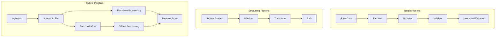

# Pipeline Patterns: 鏁版嵁娴佹按绾胯璁℃ā寮?

## 搂0 鈥?One-liner

Embodied AI 鏁版嵁娴佹按绾跨殑鏋舵瀯鍐崇瓥鍦板浘鈥斺€旀壒澶勭悊銆佹祦寮忎笌娣峰悎妯″紡鐨勯€夊瀷銆佸伐鍏烽摼涓庢渶浣冲疄璺点€?

## 搂1 鈥?Concept Map



## 搂2 鈥?Pipeline Architecture Overview

鏁版嵁娴佹按绾挎槸 embodied AI 绯荤粺鐨勮娑插惊鐜郴缁燂紝璐熻矗灏嗗師濮嬮噰闆嗘暟鎹浆鍖栦负妯″瀷鍙敤鐨勮缁冧俊鍙枫€傛牴鎹欢杩熻姹傚拰鏁版嵁鐗规€э紝娴佹按绾垮垎涓轰笁绉嶆牳蹇冩ā寮忋€?

| 缁村害 | 鎵瑰鐞?(Batch) | 娴佸紡 (Streaming) | 娣峰悎 (Hybrid) |
|------|---------------|-----------------|---------------|
| 寤惰繜瀹瑰繊 | 鍒嗛挓~灏忔椂绾?| 姣~绉掔骇 | 绉掔骇+灏忔椂绾?|
| 鍚炲悙閲?| TB/灏忔椂 | GB/鍒嗛挓 | TB/灏忔椂 + GB/鍒嗛挓 |
| 瀹归敊绛栫暐 | 閲嶈窇瀹屾暣鍒嗗尯 | 鐘舵€佸揩鐓?鍥炴斁 | 鍒嗗眰瀹归敊 |
| 閫傜敤鍦烘櫙 | 鏁版嵁闆嗘瀯寤恒€佹ā鍨嬭缁?| 鍦ㄧ嚎鎺ㄧ悊銆佸疄鏃剁洃鎺?| 鐢熶骇鐜 |
| 澶嶆潅搴?| 浣?| 涓?| 楂?|
| 鍏稿瀷宸ュ叿 | Airflow, Spark | Flink, Kafka | 涓よ€呯粍鍚?|

## 搂3 鈥?Batch Pipeline: 绂荤嚎鏁版嵁闆嗘瀯寤?

### 3.1 鏍稿績娴佺▼

鎵瑰鐞嗘祦姘寸嚎鏄?embodied AI 鏁版嵁闆嗘瀯寤虹殑涓诲姏妯″紡锛岄€傜敤浜庝粠鍘熷閲囬泦鏁版嵁鍒拌缁冩暟鎹泦鐨勫畬鏁磋浆鎹€?

```
Raw Data (ROS bags / HDF5 / MP4)
    鈫?
Ingestion (鏁版嵁鏍￠獙銆佹牸寮忕粺涓€)
    鈫?
Preprocessing (鍘诲櫔銆佹椂闂村悓姝ャ€佸帇缂?
    鈫?
Perception Pipeline (娣卞害浼拌銆丼LAM銆佹墜濮挎娴?
    鈫?
Annotation (鑷姩鏍囨敞 + 浜哄伐鏍￠獙)
    鈫?
Quality Gates (鍒嗗竷妫€鏌ャ€佸紓甯歌繃婊?
    鈫?
Dataset Assembly (鍒囧垎銆佺储寮曘€佸厓鏁版嵁)
    鈫?
Versioned Output (DVC / LakeFS)
```

### 3.2 鍒嗗尯绛栫暐

embodied AI 鏁版嵁鍏锋湁鏃剁┖灞€閮ㄦ€э紝鍚堢悊鐨勫垎鍖虹瓥鐣ョ洿鎺ュ奖鍝嶅鐞嗘晥鐜囥€?

| 鍒嗗尯缁村害 | 绛栫暐 | 閫傜敤鍦烘櫙 |
|----------|------|----------|
| 鏃堕棿绐楀彛 | 鎸夊皬鏃?澶?浼氳瘽鍒嗗尯 | 杩炵画閲囬泦鏁版嵁 (Ego-centric, 閬ユ搷浣? |
| 浠诲姟绫诲瀷 | 鎸夋搷浣滀换鍔″垎鍖?| 缁撴瀯鍖栭噰闆?(UMI, 閬ユ搷浣? |
| 鍦烘櫙鏍囩 | 鎸夌幆澧?鐗╀綋鍒嗗尯 | Sim2Real 鏁版嵁 |
| 璐ㄩ噺绛夌骇 | 鎸夌疆淇″害鍒嗗尯 | 澶氳疆杩唬璁粌 |

### 3.3 涓氱晫瀹炶返

**Open X-Embodiment Dataset 鏋勫缓娴佺▼**

Google DeepMind 鍦ㄦ瀯寤?Open X-Embodiment 鏁版嵁闆嗘椂閲囩敤浜嗘爣鍑嗗寲鎵瑰鐞嗘祦姘寸嚎锛?

1. **缁熶竴 Schema**: 鎵€鏈夋潵婧愭暟鎹浆鎹负 RLDS (Reinforcement Learning Datasets) 鏍煎紡
2. **璐ㄩ噺杩囨护**: 鍩轰簬杞ㄨ抗闀垮害銆佸姩浣滃箙搴︺€佹垚鍔熺巼绛夋寚鏍囪繃婊や綆璐ㄩ噺鏍锋湰
3. **缁熻瀵归綈**: 瀵逛笉鍚屾満鍣ㄤ汉骞冲彴鐨勫姩浣滅┖闂磋繘琛屽綊涓€鍖?
4. **鐗堟湰绠＄悊**: 浣跨敤璇箟鍖栫増鏈彿绠＄悊鏁版嵁闆嗚凯浠?

**鍏抽敭鍙傛暟**

| 鍙傛暟 | 鍏稿瀷鍊?| 璇存槑 |
|------|--------|------|
| 鍒嗗尯澶у皬 | 1-10 GB | 骞宠　骞惰搴︿笌璋冨害寮€閿€ |
| 浠诲姟骞跺彂 | 50-200 workers | 鍙栧喅浜庤绠楄祫婧?|
| 閲嶈瘯娆℃暟 | 3 | 缃戠粶/瀛樺偍鎶栧姩瀹归敊 |
| 瓒呮椂璁剧疆 | 2-4 灏忔椂/浠诲姟 | 闃叉 hung task |

## 搂4 鈥?Streaming Pipeline: 瀹炴椂鏁版嵁澧炲己涓庡鐞?

### 4.1 鏍稿績鍦烘櫙

娴佸紡澶勭悊鍦?embodied AI 涓富瑕佺敤浜庯細

- **鍦ㄧ嚎鏁版嵁澧炲己**: 瀹炴椂瀵逛紶鎰熷櫒娴佽繘琛屽煙闅忔満鍖栥€侀鑹叉姈鍔?
- **鐩戞帶涓庡憡璀?*: 瀹炴椂妫€娴嬮噰闆嗚川閲忓紓甯?(鐩告満涓㈠抚銆両MU 婕傜Щ)
- **澧為噺瀛︿範**: 鏂伴噰闆嗘暟鎹疄鏃惰繘鍏ヨ缁冨惊鐜?
- **浜烘満鍗忎綔**: 閬ユ搷浣滀腑鐨勫疄鏃跺姏鍙嶉涓庤瑙夊弽棣?

### 4.2 绐楀彛绛栫暐

娴佸鐞嗙殑鏍稿績鏄獥鍙ｈ璁★紝embodied AI 鏁版嵁鍏锋湁寮烘椂搴忎緷璧栥€?

| 绐楀彛绫诲瀷 | 瀹氫箟 | 閫傜敤鍦烘櫙 |
|----------|------|----------|
| 婊氬姩绐楀彛 (Tumbling) | 鍥哄畾鏃堕暱锛屼笉閲嶅彔 | 姣忕甯х巼缁熻 |
| 婊戝姩绐楀彛 (Sliding) | 鍥哄畾鏃堕暱锛屽彲閲嶅彔 | 骞虫粦鐨勫疄鏃舵寚鏍?|
| 浼氳瘽绐楀彛 (Session) | 娲诲姩闂撮殭瑙﹀彂鍒囧垎 | 鎿嶄綔浠诲姟杈圭晫妫€娴?|
| 鍏ㄥ眬绐楀彛 (Global) | 鍏ㄩ噺鏁版嵁锛屾樉寮忚Е鍙?| 瀹屾暣杞ㄨ抗鍒嗘瀽 |

### 4.3 鐘舵€佺鐞?

娴佸紡澶勭悊涓殑鐘舵€佺鐞嗘槸鍏抽敭鎸戞垬锛?

```
Keyed State (浠?session/robot_id 涓洪敭)
    鈹溾攢鈹€ Camera Calibration Cache
    鈹溾攢鈹€ SLAM Local Map
    鈹溾攢鈹€ Hand Tracking History
    鈹斺攢鈹€ Task Progress

Operator State (绠楀瓙绾у埆)
    鈹溾攢鈹€ Aggregation Buffers
    鈹溾攢鈹€ Watermark Trackers
    鈹斺攢鈹€ Checkpoint Snapshots
```

**鐘舵€佸悗绔€夋嫨**

| 鍚庣 | 寤惰繜 | 瀹归噺 | 閫傜敤鍦烘櫙 |
|------|------|------|----------|
| Memory | <1ms | GB绾?| 鐑紦瀛樸€佸揩閫熻仛鍚?|
| RocksDB | 1-10ms | TB绾?| 澶х姸鎬併€佺簿纭竴娆?|
| Remote (Redis) | 5-50ms | 鍙墿灞?| 璺ㄤ换鍔″叡浜姸鎬?|

## 搂5 鈥?Hybrid Pipeline: 鐢熶骇鐜鏈€浣冲疄璺?

### 5.1 Lambda Architecture 鍙樹綋

embodied AI 鐢熶骇鐜閫氬父閲囩敤 Lambda/Kappa 鏋舵瀯鐨勫彉浣擄細

```
                    鈹屸攢鈹€鈹€鈹€鈹€鈹€鈹€鈹€鈹€鈹€鈹€鈹€鈹€鈹€鈹€鈹€鈹€鈹?
    Sensor Stream 鈹€鈹€鈹? Stream Layer   鈹溾攢鈹€鈹€鈻?Real-time Dashboard
                    鈹? (Flink/Spark)  鈹?    Online Validation
                    鈹斺攢鈹€鈹€鈹€鈹€鈹€鈹€鈹€鈹攢鈹€鈹€鈹€鈹€鈹€鈹€鈹€鈹?
                             鈹?
                    鈹屸攢鈹€鈹€鈹€鈹€鈹€鈹€鈹€鈻尖攢鈹€鈹€鈹€鈹€鈹€鈹€鈹€鈹?
                    鈹? Feature Store    鈹?
                    鈹? (Feast/Tecton)   鈹?
                    鈹斺攢鈹€鈹€鈹€鈹€鈹€鈹€鈹€鈹攢鈹€鈹€鈹€鈹€鈹€鈹€鈹€鈹?
                             鈹?
    鈹屸攢鈹€鈹€鈹€鈹€鈹€鈹€鈹€鈹€鈹€鈹€鈹€鈹€鈹€鈹€鈹€鈹€鈹€鈹€鈹€鈹€鈹€鈹€鈹€鈹?
    鈹?
    鈻?
鈹屸攢鈹€鈹€鈹€鈹€鈹€鈹€鈹€鈹€鈹€鈹€鈹€鈹€鈹€鈹€鈹?     鈹屸攢鈹€鈹€鈹€鈹€鈹€鈹€鈹€鈹€鈹€鈹€鈹€鈹€鈹€鈹€鈹€鈹€鈹?
鈹?Batch Layer   鈹?     鈹? Serving Layer  鈹?
鈹?(Spark/Dask)  鈹傗攢鈹€鈹€鈹€鈹€鈻衡攤  (Model Training)鈹?
鈹?(Daily/Hourly)鈹?     鈹?                鈹?
鈹斺攢鈹€鈹€鈹€鈹€鈹€鈹€鈹€鈹€鈹€鈹€鈹€鈹€鈹€鈹€鈹?     鈹斺攢鈹€鈹€鈹€鈹€鈹€鈹€鈹€鈹€鈹€鈹€鈹€鈹€鈹€鈹€鈹€鈹€鈹?
```

### 5.2 鍒嗗眰瀛樺偍绛栫暐

| 灞傜骇 | 瀛樺偍浠嬭川 | 淇濈暀鍛ㄦ湡 | 鐢ㄩ€?|
|------|----------|----------|------|
| Hot | SSD / NVMe | 7 澶?| 瀹炴椂鏌ヨ銆佽皟璇?|
| Warm | Object Storage (S3/OSS) | 90 澶?| 璁粌鏁版嵁璇诲彇 |
| Cold | Archive (Glacier) | 姘镐箙 | 鍚堣銆佸洖婧?|

### 5.3 鏁版嵁琛€缂樿拷韪?

鐢熶骇鐜蹇呴』缁存姢瀹屾暣鐨勬暟鎹缂?(Data Lineage)锛?

```
Raw ROS bag (uuid: abc123)
    鈹溾攢鈹€ processed by: ingestion@v2.1
    鈹溾攢鈹€ produced: synchronized_frames
    鈹?      鈹斺攢鈹€ processed by: depth_estimation@v1.5
    鈹?              鈹斺攢鈹€ produced: depth_maps
    鈹?                      鈹斺攢鈹€ consumed by: training_run#4567
    鈹斺攢鈹€ produced: imu_data
            鈹斺攢鈹€ processed by: slam@v3.0
                    鈹斺攢鈹€ produced: trajectory
                            鈹斺攢鈹€ consumed by: annotation@manual
                                    鈹斺攢鈹€ produced: action_labels
```

## 搂6 鈥?Data Version Management

### 6.1 DVC (Data Version Control)

DVC 鏄満鍣ㄥ涔犳暟鎹増鏈鐞嗙殑浜嬪疄鏍囧噯宸ュ叿銆?

**鏍稿績鏈哄埗**

| 姒傚康 | 璇存槑 | 绫绘瘮 Git |
|------|------|----------|
| `.dvc` 鏂囦欢 | 鏁版嵁鏂囦欢鐨勫厓鏁版嵁鎸囬拡 | `.git` 鎸囬拡 |
| `dvc.yaml` | 娴佹按绾垮畾涔?| `Makefile` |
| Remote Storage | 鏁版嵁瀹為檯瀛樺偍浣嶇疆 (S3/GCS) | Remote Repository |
| Reproducibility | `dvc repro` 閲嶈窇娴佹按绾?| `git checkout` |

**embodied AI 鏈€浣冲疄璺?*

```yaml
# dvc.yaml
stages:
  ingest:
    cmd: python scripts/ingest_rosbags.py --input raw/ --output staging/
    deps:
      - scripts/ingest_rosbags.py
      - raw/
    outs:
      - staging/

  calibrate:
    cmd: python scripts/calibrate.py --input staging/ --output calibrated/
    deps:
      - scripts/calibrate.py
      - staging/
    outs:
      - calibrated/

  annotate:
    cmd: python scripts/auto_annotate.py --input calibrated/ --output annotated/
    deps:
      - scripts/auto_annotate.py
      - models/detector.pkl
      - calibrated/
    outs:
      - annotated/
    metrics:
      - metrics/annotation_coverage.json:
          cache: false
```

### 6.2 LakeFS

LakeFS 鎻愪緵 Git-like 鐨勬暟鎹箹鐗堟湰绠＄悊锛岄€傚悎澶ц妯℃暟鎹泦銆?

| 鐗规€?| DVC | LakeFS |
|------|-----|--------|
| 鐗堟湰绮掑害 | 鏂囦欢绾?| 瀵硅薄瀛樺偍鍓嶇紑绾?|
| 鍒嗘敮/鍚堝苟 | 鏈夐檺鏀寔 | 瀹屾暣鏀寔 |
| 瀛樺偍鍚庣 | 浠绘剰 (S3/GCS/Local) | S3-compatible |
| 鎬ц兘 | 閫傚悎 <100TB | 閫傚悎 >100TB |
| 涓€鑷存€т繚璇?| 鐢ㄦ埛绠＄悊 | ACID (閫氳繃棰勭URL) |

**閫夊瀷寤鸿**

- 瀹為獙闃舵 / 涓皬瑙勬ā (<50TB): DVC
- 鐢熶骇鐜 / 澶氬洟闃熷崗浣?/ 澶ц妯?(>100TB): LakeFS
- 娣峰悎鏂规: DVC 绠＄悊浠ｇ爜+娴佹按绾匡紝LakeFS 绠＄悊鍘熷鏁版嵁婀?

## 搂7 鈥?Pipeline Orchestration Tools

### 7.1 宸ュ叿瀵规瘮

| 缁村害 | Apache Airflow | Prefect | Dagster |
|------|---------------|---------|---------|
| 缂栫▼妯″瀷 | DAG (鏈夊悜鏃犵幆鍥? | 鍔ㄦ€?DAG | 杞欢瀹氫箟璧勪骇 (SDA) |
| 浠诲姟鎶借薄 | Operator | Task | Asset/Op |
| 鏁版嵁鎰熺煡 | 寮?(XCom 浼犻€? | 涓瓑 (Result 瀵硅薄) | 寮?(鍘熺敓 Asset 渚濊禆) |
| 璋冭瘯浣撻獙 | 鏃ュ織 + UI | 鏈湴璋冭瘯浼樺厛 | 鍒嗗尯绾ц拷婧?|
| 閮ㄧ讲澶嶆潅搴?| 涓瓑 (闇€ DB/Scheduler) | 浣?(Cloud-native) | 涓瓑 |
| 绀惧尯鐢熸€?| 鏈€澶?| 澧為暱涓?| 涓撴敞鏁版嵁宸ョ▼ |
| 閫傚悎鍦烘櫙 | 浼犵粺 ETL | 鐜颁唬 ML Pipeline | 鏁版嵁骞冲彴宸ョ▼ |

### 7.2 Airflow: 鎴愮啛绋冲畾涔嬮€?

Airflow 鏄笟鐣屾渶鎴愮啛鐨勬祦姘寸嚎缂栨帓宸ュ叿锛岄€傚悎宸叉湁鏁版嵁宸ョ▼鍥㈤槦鐨?embodied AI 椤圭洰銆?

**embodied AI DAG 绀轰緥**

```python
from airflow import DAG
from airflow.operators.python import PythonOperator
from datetime import datetime, timedelta

with DAG(
    'embodied_data_pipeline',
    default_args={'retries': 3, 'retry_delay': timedelta(minutes=5)},
    schedule_interval='@hourly',
    catchup=False,
) as dag:

    ingest = PythonOperator(
        task_id='ingest_raw_data',
        python_callable=ingest_rosbags,
        op_kwargs={'source': 's3://raw-bucket/'}
    )

    calibrate = PythonOperator(
        task_id='calibrate_sensors',
        python_callable=run_kalibr_pipeline
    )

    depth = PythonOperator(
        task_id='depth_estimation',
        python_callable=run_foundation_stereo
    )

    annotate = PythonOperator(
        task_id='auto_annotate',
        python_callable=run_vlm_annotation
    )

    validate = PythonOperator(
        task_id='quality_validation',
        python_callable=run_quality_gates
    )

    ingest >> calibrate >> depth >> annotate >> validate
```

### 7.3 Prefect: 鐜颁唬 ML 浼樺厛

Prefect 2.x 閲囩敤 "flows" 鍜?"tasks" 鐨勮交閲忔娊璞★紝鏇撮€傚悎蹇€熻凯浠ｇ殑 ML 瀹為獙銆?

```python
from prefect import flow, task
from prefect.tasks import task_input_hash

@task(cache_key_fn=task_input_hash, cache_expiration=timedelta(hours=1))
def extract_frames(video_path: str) -> list:
    return frame_extraction(video_path)

@task
def estimate_depth(frames: list, calibration: dict) -> list:
    return foundation_stereo_infer(frames, calibration)

@flow(log_prints=True)
def embodied_pipeline(source_bucket: str):
    videos = list_videos(source_bucket)
    for video in videos:
        frames = extract_frames(video)
        depth_maps = estimate_depth(frames, load_calibration())
        # ...
```

### 7.4 Dagster: 鏁版嵁璧勪骇鎬濈淮

Dagster 鐨?Software-Defined Assets (SDA) 妯″瀷鐗瑰埆閫傚悎闇€瑕佸己鏁版嵁琛€缂樼殑 embodied AI 鍦烘櫙銆?

```python
from dagster import asset, Definitions

@asset(group_name="perception")
def synchronized_frames(raw_rosbags):
    """鏃堕棿鍚屾鍚庣殑澶氫紶鎰熷櫒甯?""
    return sync_timestamps(raw_rosbags)

@asset(group_name="perception", deps=[synchronized_frames])
def depth_estimates(synchronized_frames):
    """FoundationStereo 娣卞害浼拌缁撴灉"""
    return run_depth_model(synchronized_frames)

@asset(group_name="annotation", deps=[depth_estimates])
def action_labels(depth_estimates):
    """鑷姩鏍囨敞鐨勫姩浣滄爣绛?""
    return auto_annotate(depth_estimates)

defs = Definitions(assets=[synchronized_frames, depth_estimates, action_labels])
```

## 搂8 鈥?DVAS 椤圭洰鍏宠仈

DVAS (Data Versioning for Action Systems) 鏄?embodied AI 鏁版嵁绠＄悊鐨勬牳蹇冮渶姹傦紝Pipeline Patterns 鐩存帴鏀拺浠ヤ笅鑳藉姏锛?

| DVAS 闇€姹?| Pipeline 瀹炵幇 | 宸ュ叿 |
|-----------|--------------|------|
| 鏁版嵁鍙鐜?| 鐗堟湰鍖栨祦姘寸嚎 + 纭畾鎬ф墽琛?| DVC + Airflow |
| 澧為噺鏇存柊 | 鍒嗗尯鎰熺煡澶勭悊 + 鍙樻洿妫€娴?| LakeFS + Spark |
| 璐ㄩ噺鍙拷婧?| 姣忔杈撳嚭鍏冩暟鎹褰?| Dagster Asset |
| 澶氭簮鏁村悎 | 澶氬垎鏀?DAG 鍚堝苟 | Prefect Subflows |
| 鍐风儹鍒嗗眰 | 鐢熷懡鍛ㄦ湡绛栫暐 | S3 Intelligent-Tiering |

## 搂9 鈥?Anti-Patterns

| 鍙嶆ā寮?| 闂 | 淇鏂规 |
|--------|------|----------|
| 鍗曟枃浠跺法鏁版嵁闆?| 鏃犳硶骞惰銆佹仮澶嶅洶闅?| 鎸?session/task 鍒嗗尯 |
| 纭紪鐮佽矾寰?| 鐜杩佺Щ鍥伴毦 | 閰嶇疆涓績 + 鐜鍙橀噺 |
| 鏃犲箓绛夋€т繚璇?| 閲嶈窇浜х敓閲嶅鏁版嵁 | 杈撳叆鍝堝笇鍘婚噸 + 杈撳嚭瑕嗙洊 |
| 蹇界暐鏁版嵁婕傜Щ | 妯″瀷鎬ц兘閫€鍖?| 缁熻鐩戞帶 + 鑷姩鍛婅 |
| 鍏ㄩ噺閲嶈窇渚濊禆 | 灏忔敼鍔ㄨЕ鍙戝ぇ瑙勬ā閲嶇畻 | 澧為噺妫€娴?+ 缂撳瓨绛栫暐 |

## 搂10 鈥?Decision Guide

```
鏁版嵁闆嗚妯?
鈹溾攢鈹€ < 1TB
鈹?  鈹斺攢鈹€ DVC + Prefect (杞婚噺銆佸揩閫熻凯浠?
鈹溾攢鈹€ 1TB - 100TB
鈹?  鈹斺攢鈹€ DVC/LakeFS + Airflow (鎴愮啛鐢熸€?
鈹斺攢鈹€ > 100TB
    鈹斺攢鈹€ LakeFS + Dagster + Spark (浼佷笟绾?

瀹炴椂鎬ц姹?
鈹溾攢鈹€ 绾绾胯缁?
鈹?  鈹斺攢鈹€ Batch-only (Airflow/Dagster)
鈹溾攢鈹€ 闇€瑕佸湪绾跨洃鎺?
鈹?  鈹斺攢鈹€ Batch + Stream (Airflow + Flink)
鈹斺攢鈹€ 鍦ㄧ嚎瀛︿範/澧為噺璁粌
    鈹斺攢鈹€ Hybrid (Flink + Feature Store)

鍥㈤槦瑙勬ā?
鈹溾攢鈹€ < 5浜?
鈹?  鈹斺攢鈹€ Prefect (浣庤繍缁?
鈹溾攢鈹€ 5-20浜?
鈹?  鈹斺攢鈹€ Airflow (绀惧尯璧勬簮涓板瘜)
鈹斺攢鈹€ > 20浜?/ 骞冲彴鍥㈤槦
    鈹斺攢鈹€ Dagster (寮虹被鍨嬨€佸彲鎵╁睍)
```

---

*Related: [02-quality-gates](42-quality-gates.md) | [03-system-design](43-system-design.md) | Prev: [04-data-ecosystem](../INDEX.md)*
